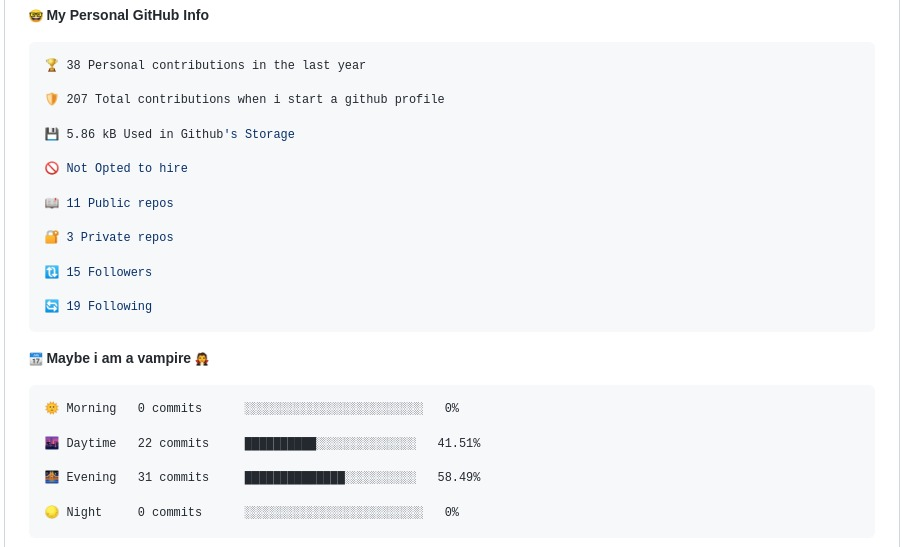

# Waka Profile Stats

## Add your dev metric into your profile readme

<p align="center">
  
  <h3 align="center">✨ Wonderfull Readme Stats</h3>
</p>

<p align="center">
   
   
   
   
</p>
<p align="center">
   Are you human 👨‍💻 or like me a vampire 🧛?
   <br/>
   How many projects are you working on at the same time?
   <br/>
   What are languages you code in?
   <br/>
   Let's check out in your profile readme!
</p>

<p align="center">
    <a href="https://github.com/anmol098/barthachijuu/waka-profile-stats/issues">Report Bug</a>
    ·
    <a href="https://github.com/anmol098/barthachijuu/waka-profile-stats/issues">Request Feature</a>
  </p>
## How to start

1. You need to update your markdown file(.md) with 2 comments. You can refer [here](#update-readme) for updating it.
2. You'll need a WakaTime API Key. You can get that from your WakaTime Account Settings
    - You can refer [here](#new-to-wakatime), if is you're first time with WakaTime
3. You'll need a GitHub API Token with `repo` and `user` scope from [here](https://github.com/settings/tokens) if you're running the action to get commit metrics
   > enabling the `repo` scope seems **DANGEROUS**<br/>
   > but this GitHub Action only accesses your commit timestamp and lines of code added or deleted in repository you contributed.
   - You can use this [example](#example) to work it out
4. You need to save the WakaTime API Key and the GitHub API Token in the repository secrets. You can find that in the Settings of your repository. Be sure to save those as the following.
    - WakaTime API Key as `WAKATIME_API_KEY=<your wakatime API Key>`
    - GitHub Personal Access Token as `GH_TOKEN=<your github access token>`
5. You can enable and disable feature options based on requirements.

This Action will run every SUNDAY at 00.00 IST

## Update Readme

Add a comment to your `README.md` like this:

```md
<!--START_SECTION:waka-->
<!--END_SECTION:waka-->
```
These lines will be our entry-points for the dev metrics.

## New to WakaTime

WakaTime gives you an idea of the time you really spent on coding. This helps you boost your productivity and competitive edge.

- Head over to <https://wakatime.com> and create an account.
- Get your WakaTime API Key from your [Account Settings in WakaTime](https://wakatime.com/settings/account).
- Install the [WakaTime plugin](https://wakatime.com/plugins) in your favourite editor / IDE.
- Paste in your API key to start the analysis.

### Profile Repository

You'll need to get a [GitHub Access Token](https://docs.github.com/en/actions/configuring-and-managing-workflows/authenticating-with-the-github_token) with a `repo` and `user` scope and save it in the Repo Secrets `GH_TOKEN = <Your GitHub Access Token>`

Here is Sample Workflow File for running it:
```yml
name: Barthachijuu Profile Stats

on:
  workflow_dispatch:
  schedule:
    # Runs at 00:00AM UTC Every SUNDAY
    - cron: '0 0 * * SUN'

jobs:
  update-readme:
    name: Update this repo's README
    runs-on: ubuntu-latest
    steps:
      - uses: barthachijuu/waka-profile-stats@main
        env:
          WAKATIME_API_KEY: ${{ secrets.WAKATIME_API_KEY }}
          GH_TOKEN: ${{ secrets.GH_TOKEN }}
```
- Now you can commit and wait for run automatically, but you can also trigger to run it to see the result now. Just go to the `Actions` in your repo and select your `Profile Readme Development Stats` workflow and click in `Run workflow`. Now wait for a minute or two and you will see your changes.

## Extras

1. If you want to add the other info to your stats, you can add multiple `FLAGS` in your workflow file by default all flags are enabled
>except the lines of code flag due to heavy operation performed

```yml
  - uses: barthachijuu/waka-profile-stats@main
        env:
          WAKATIME_API_KEY: ${{ secrets.WAKATIME_API_KEY }}
          GH_TOKEN: ${{ secrets.GH_TOKEN }}
          SHOW_OS: "False"
          SHOW_PROJECTS: "False"
```

### Options Available

---

`INPUT_COMMIT_MESSAGE`        flag can be to set message commit, default is "Updated Readme with Waka Stats"

`SHOW_UPDATED_DATE`        flag can be set to `True` to show updated date in end of paragraph

`SHOW_TOTAL_TIME`       flag can be set to `True` to show the total time you have coded


`SHOW_PROFILE`       flag can be set to `False` to hide the Profile views


`SHOW_COMMIT`       flag can be set to `False` to hide the commit stats

📆 **Maybe i am a vampire 🧛**
```text
🌞 Morning   0 commits      ░░░░░░░░░░░░░░░░░░░░░░░░░   0%

🌆 Daytime   22 commits     ██████████░░░░░░░░░░░░░░   41.51%

🌉 Evening   31 commits     ██████████████░░░░░░░░░░   58.49%

🌕 Night     0 commits      ░░░░░░░░░░░░░░░░░░░░░░░░░   0%
```

`SHOW_WEEK`       flag can be set to `False` to hide the commits made on different days of week

📅 **I do my best effort on** Thursday
 ```text
Monday       8 commits      ▒░░░░░░░░░░░░░░░░░░░░░░   9.76%

Tuesday      5 commits      ▒░░░░░░░░░░░░░░░░░░░░░░░   6.1%

Wednesday    16 commits     ████░░░░░░░░░░░░░░░░░░░░   19.51%

Thursday     37 commits     ███████████░░░░░░░░░░░░░   45.12%

Friday       16 commits     ████░░░░░░░░░░░░░░░░░░░░   19.51%

Saturday     0 commits      ░░░░░░░░░░░░░░░░░░░░░░░░░   0%

Sunday       0 commits      ░░░░░░░░░░░░░░░░░░░░░░░░░   0%
```

`SHOW_LANGUAGE`       flag can be set to `False` to hide the Coding Language You use

🏷️ ***Languages***
```text
JavaScript               13 hrs 2 mins       ████████████████████████   96.24%

Markdown                 28 mins             ▒░░░░░░░░░░░░░░░░░░░░░░░░   3.54%

Bash                     1 min               ▒░░░░░░░░░░░░░░░░░░░░░░░░   0.21%

JSON                     0 secs              ▒░░░░░░░░░░░░░░░░░░░░░░░░   0.01%
```

`SHOW_EDITORS`  flag can be set to `False` to hide the list of code-editors used

🧰 ***Editors***
```text
VS Code                  13 hrs 32 mins      █████████████████████████   100%
```

`SHOW_OS`       flag can be set to `False` to hide the OS details

📀 ***Operating System***
```text
Linux                    13 hrs 32 mins      █████████████████████████   100%
```

`SHOW_PROJECTS` flag can be set to `False` to hide the Projects worked on

💻 ***Projects***
```text
waka-profile-stats       13 hrs 32 mins      █████████████████████████   100%
```

`SHOW_LANGUAGE_PER_REPO`  flag can be set to `False` to hide the Number of repository in different language and frameworks

***I Mostly Code in*** CSS
```text
CSS                      1 repo              ████░░░░░░░░░░░░░░░░░░░░   16.67%

JavaScript               1 repo              ████░░░░░░░░░░░░░░░░░░░░   16.67%

Java                     1 repo              ████░░░░░░░░░░░░░░░░░░░░   16.67%

SCSS                     1 repo              ████░░░░░░░░░░░░░░░░░░░░   16.67%
```

`SHORT_INFO`  flag can be set to `False` to hide the short fun fact info of user
>This section requires personal access token with user permission otherwise data shown will be incorrect here

 **🤓 My Personal GitHub Info**

```properties
🏆 38 Personal contributions in the last year

🛡️ 207 Total contributions when i start a github profile

💾 5.86 kB Used in Github's Storage

🚫 Not Opted to hire

📖 11 Public repos

🔐 3 Private repos

🔃 15 Followers

🔄 19 Following

```

## 🎁 Support: Donate

> This project is **free**, **open source** and I try to provide excellent **free support**. Why donate? I work on this and other project for several hours in my spare time between my job and my lovely family, and try to keep it up to date and working. **THANK YOU!**

[](https://www.paypal.me/barthachijuu) [](https://www.patreon.com/barthachijuu)  [](https://ko-fi.com/barthachijuu)

## 👑 Sponsors

Support this project by becoming a sponsor. 🙏 Become a sponsor on [patreon](https://www.patreon.com/join/barthachijuu) or become top3 sponsor on [ko-fi](https://ko-fi.com/barthachijuu). Your logo will show up here with a link to your website.

## 👔 Backers

Thank you to all our backers! 🙏 Become a backer on [patreon](https://www.patreon.com/join/barthachijuu).

## Contributors ✨

Contributions are welcome! ♥!

Thanks goes to these wonderful people ([emoji key](https://allcontributors.org/docs/en/emoji-key)):

<!-- ALL-CONTRIBUTORS-LIST:START - Do not remove or modify this section -->
<!-- prettier-ignore -->
<table><tr><td align="center"><a href="https://barthachijuu.dev"><br /><sub><b>Bartolo Amico</b></sub></a><br /><a href="https://github.com/barthachijuu/circlemenu/commits?author=barthachijuu" title="Code">💻</a> <a href="#content-barthachijuu" title="Content">🖋</a> <a href="https://github.com/barthachijuu/circlemenu/commits?author=barthachijuu" title="Documentation">📖</a> <a href="#ideas-barthachijuu" title="Ideas, Planning, & Feedback">🤔</a> <a href="#infra-barthachijuu" title="Infrastructure (Hosting, Build-Tools, etc)">🚇</a> <a href="#maintenance-barthachijuu" title="Maintenance">🚧</a> <a href="#plugin-barthachijuu" title="Plugin/utility libraries">🔌</a> <a href="#projectManagement-barthachijuu" title="Project Management">📆</a></td></tr></table>

<!-- ALL-CONTRIBUTORS-LIST:END -->

This project follows the [all-contributors](https://github.com/all-contributors/all-contributors) specification. Contributions of any kind welcome!

## License

This project is licensed under the MIT license, Copyright (©) 2022 Bartolomeo Amico. For more information see `LICENSE.md`


- If ever you are using it right now, please tell me by sending a [Special Mention](https://github.com/bartahachijuu/waka-profile-stats/issues/new/choose) issue :blush: and I will be happy to add you to a list you will see here
-
## Inspired From

> [waka-box](https://github.com/matchai/waka-box) <br/>
> [anmol098/waka-readme-stats](https://github.com/anmol098/waka-readme-stats/)

### This project need a **star** ⭐ from you to get even cooler. 🆒
